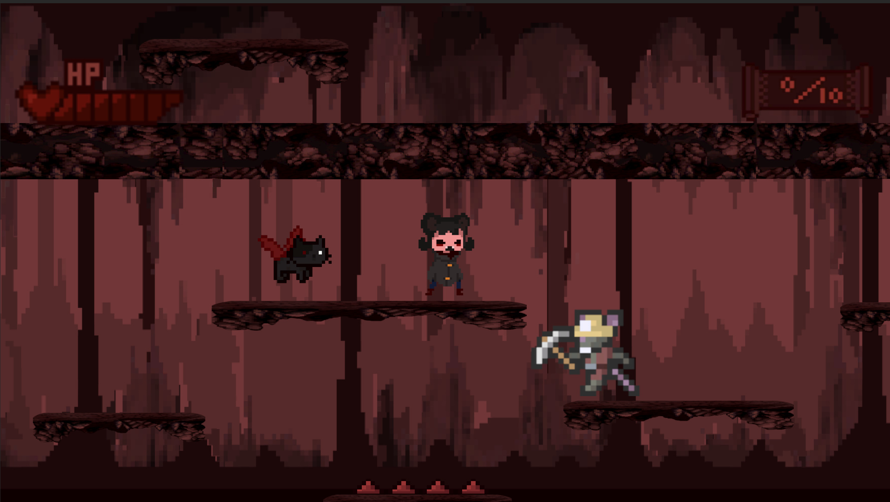
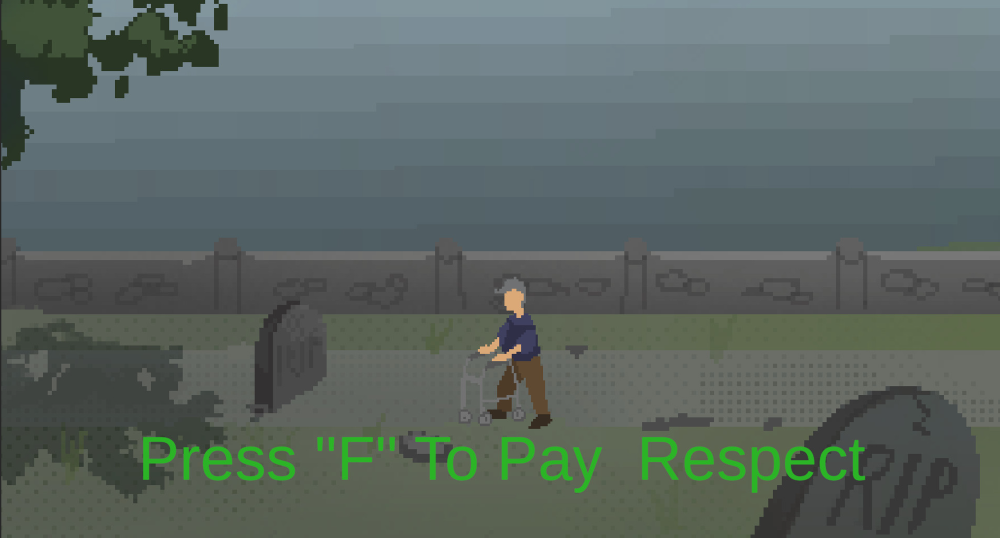
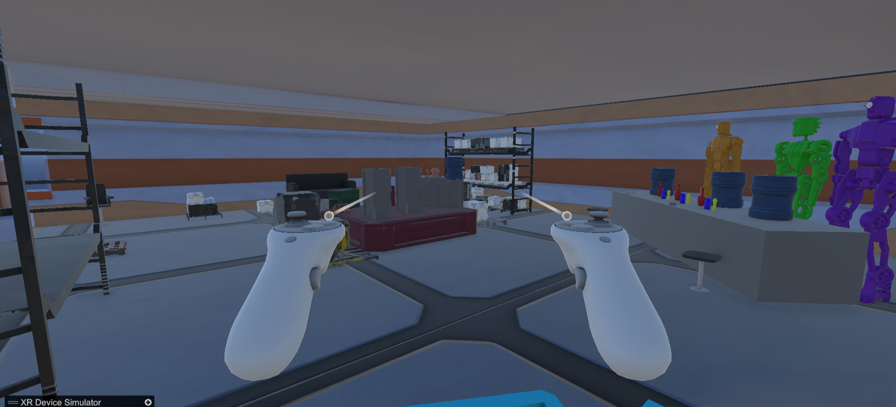

# Game Development Portfolio (Łukasz Drobik)

## About Me  
Hi, I'm a Game Development student at Collegium Da Vinci, and this is my project portfolio.  
I'm an aspiring programmer, primarily working with Unity, though I've also created projects in Unreal Engine 5. I'm a fast learner, constantly improving my skills with each new project. Beyond academic assignments, I've participated in Game Jams, gaining hands-on experience in rapid prototyping and teamwork.  

## Projects  

### EQSys  
- **Description**: A university assignment where I implemented an inventory system with drag-and-drop functionality. I expanded it with item stacking and splitting mechanics. Each item has a unique function that interacts with the game world.  
- **Tech**: Unity  
- **Role**: Programming  
- [GitHub Repository](https://github.com/S0l4k/EQSys)
 

### Echoes of The Fallen  
- **Description**: A 2D platformer created with my team as a university project. The player takes on the role of a bored demon terrorizing innocent inhabitants of a fantasy kingdom. The game is currently a demo, but we plan to develop it further.  
- **Tech**: Unity  
- **Role**: Programming  
- [GitHub Repository](https://github.com/S0l4k/Echoes-of-the-Fallen)
  
  
  
  

### Levels of Life  
- **Description**: Created during the 40-hour PogJam, where the theme was "level." The game represents life as a series of levels, each depicting a different stage of human existence—from infancy to old age and death. The gameplay consists of mini-games reflecting life's challenges at different ages.  
- **Tech**: Unity  
- **Role**: Programming, Design  
- [GitHub Repository](https://github.com/S0l4k/LevelsOfLife)
-  **Play Levels of Life on Itch.io:** [https://s0lon.itch.io/levels-of-life](https://s0lon.itch.io/levels-of-life)
  
 
 
 

### ZapZapZapVR
- **Description**: A VR game set aboard a spaceship. The player’s task is to solve puzzle games in order to open a mysterious box. A university group project — our goal was to create a VR Escape Room game. We chose a space-themed setting and gave the project a humorous, meme-like character.
- **Tech**: Unity, C#
- **Role**: Programmer, Designer, Sound Design
- [GitHub Repository](https://github.com/S0l4k/VR)
  
